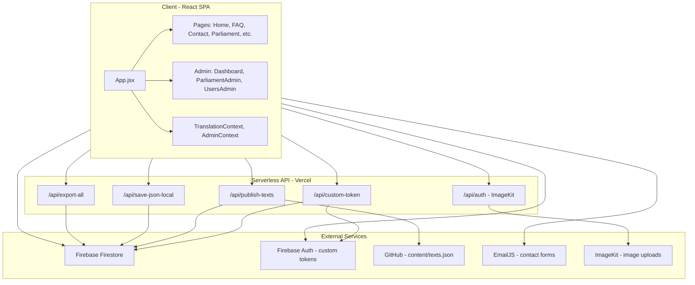

# High-Level Design (HLD) — School Website

Single source of truth for architecture, boundaries, and integration points. Target: architects and developers starting from zero.

---

## 1.1 System Overview

- **School/public website** (Hebrew RTL, bilingual he/en): marketing pages, contact, parent committee, parents association, and a **Parliament** feature (student/parent submissions and admin queue).
- **Admin:** Dashboard (translations, users), Parliament admin (dates, subjects, approve/reject), role-based access.

---

## 1.2 Architecture Diagram

---

## 1.3 Tech Stack

| Layer | Technology |
|-------|------------|
| **Frontend** | React 19, Vite 5, react-router-dom v6. No Redux; React Context (Translation, Admin). |
| **Backend** | Vercel serverless (API routes in `api/`); optional Netlify function for ImageKit (`netlify/functions/auth.js`); optional local ImageKit auth server (`server/auth-server.js`). |
| **Data** | Firebase Firestore only (no Realtime DB). Firebase Auth used only for custom tokens (write access); primary "login" is DB-backed (session in localStorage). |
| **Content/Deploy** | GitHub repo for `content/texts.json`; Vercel rewrites (`vercel.json`) for API + SPA. |

---

## 1.4 Authentication and Authorization

- **Parliament/app login:** Username + password; credentials checked against Firestore `appUsers` (passwordHash = SHA-256). Session stored in `localStorage.session`; optional Firebase custom token from `api/custom-token.js` for Firestore write rules.
- **System admin:** Special user (e.g. `admin` / `ADMIN_PASSWORD`) gets custom token with admin claim; redirect to `/admin/dashboard`.
- **Roles:** student, parent, committee, editor, manager, admin. RBAC via `src/utils/requireRole.jsx` and Firestore `appUsers` (role/roles). Admin routes protected by `AdminRoute` and `RequireRole`.

---

## 1.5 Data Flow (High Level)

- **Translations:** Load from Firestore `translations/{he|en}` or static JSON; admin saves to Firestore or publishes to GitHub via `/api/publish-texts`.
- **Parliament:** Dates/subjects/notes in Firestore; public read; writes require auth (custom token). Caching in `src/services/firebaseDB.js` (5-min in-memory + localStorage).
- **Contacts:** Form submissions → Firestore `contacts`; optional EmailJS for email.

---

## 1.6 Security Boundaries

- **Firestore rules** (`firestore.rules`): public read for content/parliament; writes require `request.auth != null`. API uses Firebase Admin (bypasses rules); custom token endpoint validates credentials then issues token.
- **Secrets:** `FIREBASE_SERVICE_ACCOUNT`, `ADMIN_PASSWORD`, `GITHUB_*`, `IMAGEKIT_PRIVATE_KEY`, `VITE_*` for client. See [ENV_REFERENCE.md](ENV_REFERENCE.md).

---

## 1.7 Deployment

- **Build:** `vite build`; output static + serverless.
- **Vercel:** Rewrites for `/api/*` to corresponding `api/*.js` and SPA fallback to `index.html`.

---

## 1.8 Testing

- **Unit/API:** Vitest — `npm run test`, `npm run test:api`.
- **E2E:** Playwright — `npm run test:e2e`.
- **E2E HLD coverage:** `e2e/hld-coverage.spec.js` contains scenarios mapped to this document: public contact page and form, unauthorized page, RBAC (editor denied parliament admin), system admin login redirect, parliament public read, and admin dashboard/parliament reachability.
- Full details: [TESTING.md](../TESTING.md) in project root.

---

## 1.9 Documentation

- **LLD:** [docs/LLD.md](LLD.md) — modules, routes, collections, APIs, env vars, key files.
- **Setup:** [COMPLETE_SETUP_GUIDE.md](../COMPLETE_SETUP_GUIDE.md) — clone, install, env, first run.
- **Rebuild from zero:** [docs/REBUILD_CHECKLIST.md](REBUILD_CHECKLIST.md) — ordered steps.
- **API:** [docs/API_SPEC.md](API_SPEC.md) — endpoint contracts.
- **Environment:** [docs/ENV_REFERENCE.md](ENV_REFERENCE.md) — all env vars.
- **Firestore:** [docs/FIRESTORE_DATA_MODEL.md](FIRESTORE_DATA_MODEL.md) — collections and rules.
- **Troubleshooting:** [docs/TROUBLESHOOTING_INDEX.md](TROUBLESHOOTING_INDEX.md) — index of troubleshooting guides.
